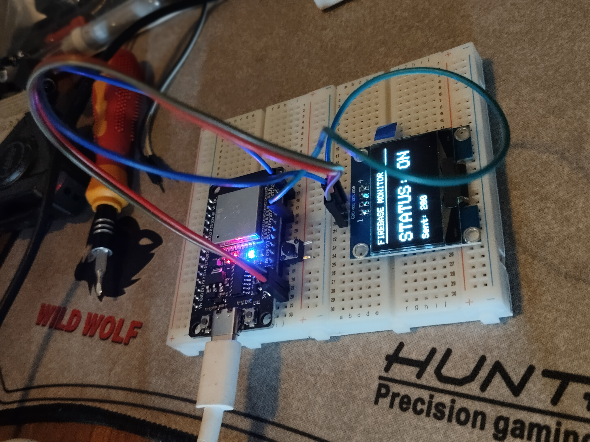
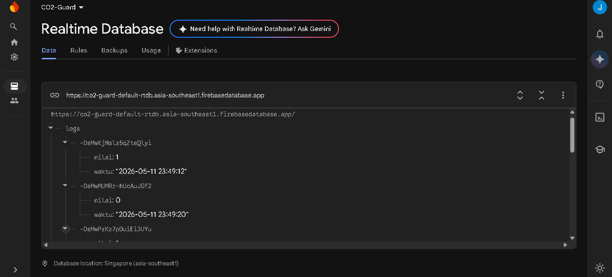
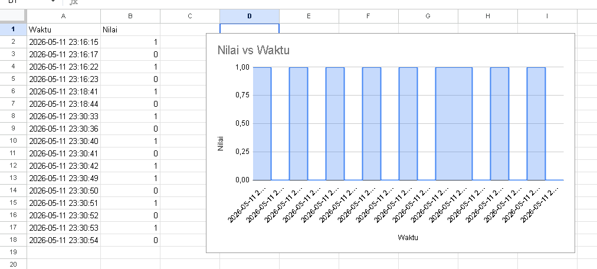

# 🌿 CO2-Guard: Real-Time IoT Monitoring System

[](#)
[](#)
[](#)

CO2-Guard adalah sistem monitoring berbasis IoT yang dirancang untuk melacak status dan log data secara real-time. Dengan integrasi **Firebase Realtime Database** dan **Google Sheets**, sistem ini mampu menyajikan visualisasi data yang akurat untuk pemantauan jangka panjang.

---

## 📸 Visualisasi Project

|              Tampilan Device              |               Dashboard Firebase                |             Spreadsheet             |
| :---------------------------------------: | :---------------------------------------------: | :---------------------------------: |
|  |  |  |
|        _Prototype ESP32 + SH1106_         |            _Struktur Data JSON Logs_            |          _Isi Spreadsheet_          |

### 🎥 Demo Video

[](img/demo_video.mp4)
_(Klik link di atas atau tonton `img/demo_video.mp4` untuk melihat cara kerja toggle dan sinkronisasi data)_

---

## 🚀 Cara Kerja Sistem

Project ini menggunakan alur **RESTful API** yang efisien untuk meminimalisir beban kerja (overhead) pada mikrokontroler:

1.  **Input Trigger:** User menekan tombol pada GPIO 17 (dengan filter _Debounce_ untuk akurasi).
2.  **Toggle Logic:** Sistem mengubah status (ON ke OFF atau sebaliknya) tanpa perlu menahan tombol.
3.  **Time Synchronization:** ESP32 menghubungi **NTP Server** (`pool.ntp.org`) untuk mendapatkan stempel waktu (Timestamp) yang akurat sesuai zona waktu WIB.
4.  **Data Transmission:** Data berupa `nilai` dan `waktu` dikirim ke **Firebase** melalui protokol **HTTPS** menggunakan `WiFiClientSecure`.
5.  **Local Feedback:** Layar **OLED SH1106** menampilkan status koneksi dan respon HTTP (misalnya kode `200` jika sukses).
6.  **Analytics:** Google Sheets menarik data dari Firebase secara berkala menggunakan **Apps Script** untuk diolah menjadi diagram.

---

## 🛠️ Aspek Teknis & Fitur

- **Hardware:** ESP32 DevKit V1, SH1106 OLED 1.3", Push Button.
- **Security:** Koneksi aman menggunakan HTTPS dengan mode `setInsecure()` untuk fleksibilitas sertifikat SSL pada prototype.
- **Efisiensi Memori:** Tidak menggunakan library Firebase yang berat, melainkan menggunakan `HTTPClient` standar untuk operasi REST API yang lebih ringan.
- **Data Integrity:** Menggunakan metode `POST` (Push) sehingga data lama tidak tertimpa dan tersimpan sebagai riwayat (History).
- **User Interface:** UI sederhana namun informatif pada layar OLED untuk monitoring status tanpa serial monitor.

---

## 🔌 Konfigurasi Pin

| Komponen       | Pin ESP32 | Fungsi                    |
| :------------- | :-------- | :------------------------ |
| **Button**     | GPIO 17   | Input (Internal Pull-up)  |
| **GND Button** | GPIO 4    | Ground Buatan (Logic LOW) |
| **OLED SDA**   | GPIO 21   | I2C Data                  |
| **OLED SCL**   | GPIO 22   | I2C Clock                 |
| **LED**        | GPIO 2    | Indikator Internal        |

---

## 📦 Instalasi & Setup

1.  Clone repository ini.
2.  Install library berikut di Arduino IDE:
    - `Adafruit GFX Library`
    - `Adafruit SH110X`
3.  Buat file `arduino_secrets.h` di folder yang sama dan isi kredensial lo:
    ```cpp
    #define SECRET_SSID "NamaWiFi"
    #define SECRET_PASS "PasswordWiFi"
    #define SECRET_FIREBASE_URL "https://project-lo.firebasedatabase.app/logs.json"
    #define SECRET_FIREBASE_API "AIzaSy..."
    ```
4.  Upload `prototype.ino` ke ESP32 lo.

---

## 📈 Roadmap Pengembangan

- [x] Integrasi Realtime Database.
- [x] Logging data dengan Timestamp.
- [x] Visualisasi di Google Sheets.
- [ ] Implementasi Notifikasi Telegram via Google Apps Script.
- [ ] Penambahan sensor CO2 (MH-Z19B atau MQ-135).

---

_Dibuat dengan ❤️ oleh Ega dibantu Gemini Oh My Cintaku My Love Muach_

---
