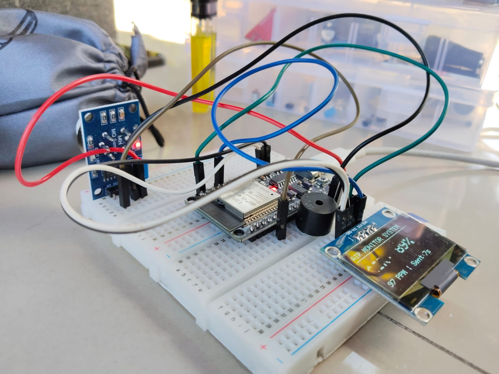
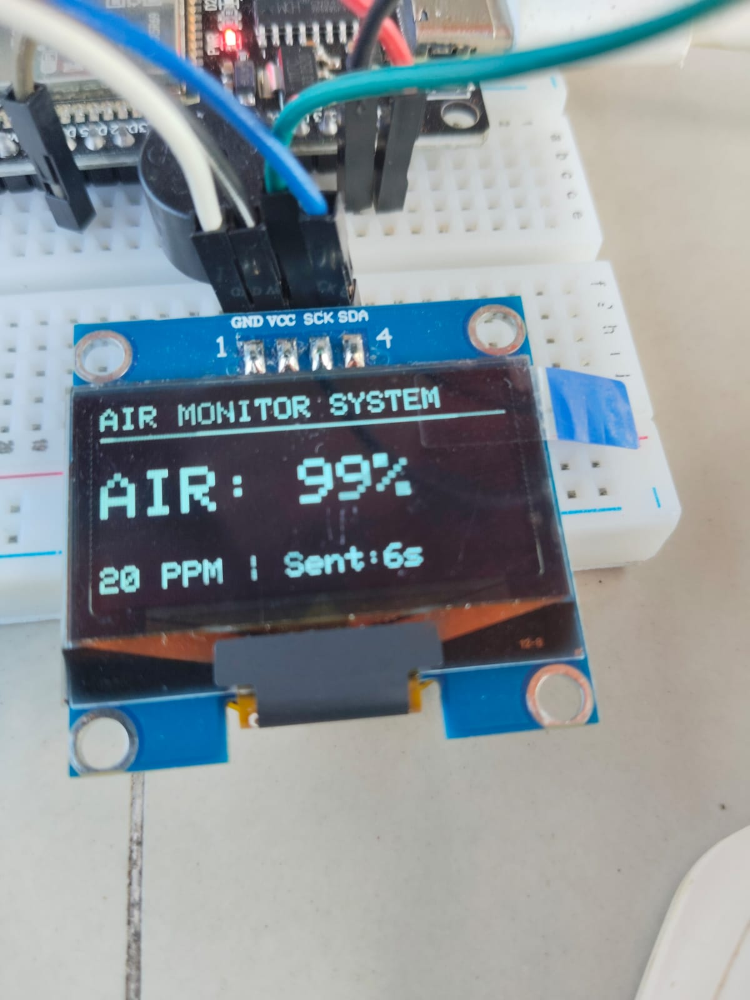
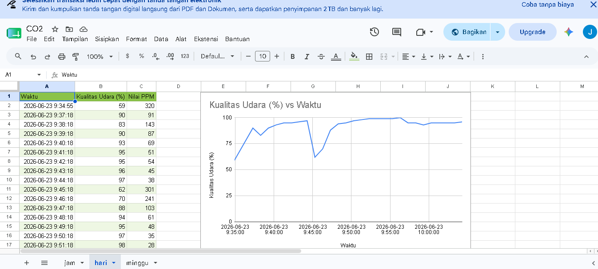

# 🔌 Sistem Prototipe CO₂-Guard (ESP32 & MQ Air Sensor)

Halaman ini berisi dokumentasi teknis, skema pengkabelan, dan kode sumber untuk unit sensor **CO₂-Guard**. Sistem ini dirancang untuk melakukan pemantauan kualitas udara secara _real-time_, memberikan indikasi bahaya lokal (visual & audio), serta mentransmisikan data ganda ke Firebase Cloud menggunakan protokol HTTPS REST API.

---

## 📸 Dokumentasi Perangkat & Sistem

Silakan letakkan dokumentasi foto perangkat keras dan antarmuka sistem pada folder `img/` dengan penamaan file sebagai berikut:

|                 Rakitan Prototipe                 |            Tampilan Layar OLED            |
| :-----------------------------------------------: | :---------------------------------------: |
|  |  |
|        _Rakitan komponen pada breadboard_         |   _Indikator kualitas udara real-time_    |

### 📊 Tampilan Dashboard Google Sheets

Data yang tersimpan di Firebase Realtime Database ditarik secara otomatis menggunakan Google Apps Script (berbasis JavaScript) dan divisualisasikan dalam bentuk grafik pada spreadsheet berikut:

  
_(Tempatkan tangkapan layar visualisasi grafik/diagram lini dari Google Sheets kamu pada file `img/spreadsheet_screenshot.png`)_

### 📁 Dokumentasi Tambahan (Google Drive)

Seluruh berkas pendukung termasuk skema sirkuit resolusi tinggi, desain mekanis, dan video demonstrasi cara kerja alat dapat diakses melalui tautan berikut:
👉 **[Akses Google Drive Proyek CO₂-Guard](https://drive.google.com/drive/folders/1tv328Ez0x0NtixvVz7K_F9ChKPOjlanl?usp=sharing)**

---

## 🛠️ Fitur Utama Sistem

- **Pemrosesan Data Ganda:** Membaca data analog melalui pin ADC (GPIO 34) kemudian memetakan (_mapping_) nilainya menjadi dua indikator sekaligus: **Persentase Kualitas Udara (0-100%)** dan **Estimasi Nilai PPM (10-1000 PPM)**.
- **Smart Alert (Non-Blocking Buzzer):** Alarm berbunyi putus-putus (_bip_) setiap 300 milidetik jika kualitas udara turun di bawah ambang batas aman (< 50%). Logika ini menggunakan fungsi `millis()` sehingga buzzer berbunyi tanpa menghentikan jalannya pengiriman data atau pembaruan layar (_non-blocking delay_).
- **Ground Buatan (Pseudo-GND Trick):** Memanfaatkan baris GPIO pin pada ESP32 secara efisien dengan mengonfigurasi GPIO 14 konstan `LOW` untuk menyamar sebagai Ground alternatif bagi kaki negatif buzzer fisik.
- **Dual Timestamping:** Mengirimkan data waktu ganda ke Firebase, berupa format teks biasa (`%Y-%m-%d %H:%M:%S`) melalui sinkronisasi NTP Server, sekaligus format data Unix Epoch Milliseconds (`waktu_ms`) guna memudahkan pembuatan diagram linier (Time-Series) di Google Sheets.

---

## 🔌 Skema Pengkabelan (Wiring Diagram)

| Komponen                   | Pin Modul       | Pin ESP32 DevKit V1 | Peran / Fungsi                  |
| :------------------------- | :-------------- | :------------------ | :------------------------------ |
| **Sensor Gas (MQ Series)** | VCC             | Vin (5V)            | Catu daya sensor gas            |
|                            | GND             | GND                 | Ground bersama                  |
|                            | AO (Analog Out) | GPIO 34 (ADC1_CH6)  | Input pembacaan tegangan analog |
| **OLED SH1106 1.3"**       | VCC             | 3V3 / Vin           | Catu daya layar                 |
|                            | GND             | GND                 | Ground bersama                  |
|                            | SDA             | GPIO 21             | Jalur data komunikasi I2C       |
|                            | SCL             | GPIO 22             | Jalur clock komunikasi I2C      |
| **Buzzer Piezo**           | Positif (+)     | GPIO 25             | Kontrol logika ON/OFF alarm     |
|                            | Negatif (-)     | GPIO 14             | Ground buatan (Output LOW)      |
| **LED Indikator**          | LED Onboard     | GPIO 2              | Kedip saat paket data dikirim   |

---

## 📐 Konversi Logika & Matematika

Program mengolah sinyal mentah tegangan dari sensor menggunakan dua rumus pemetaan linier:

1. **Kualitas Udara Bersih:**
   $$Kualitas (\%) = \text{constrain}(\text{map}(ADC, 400, 3200, 100, 0), 0, 100)$$
   _Semakin tinggi partikel polutan terdeteksi, nilai persentase akan turun ke $0\%$._

2. **Estimasi Kerapatan Gas (PPM):**
   $$PPM = \text{map}(ADC, 400, 4095, 10, 1000)$$
   _Memberikan representasi nilai estimasi numerik gas di dalam ruangan._

---

## 🚀 Langkah Menjalankan Perangkat

1. Pastikan library berikut telah terinstal pada Arduino IDE kamu:
   - **Adafruit GFX Library**
   - **Adafruit SH110X**
2. Buat file bernama `arduino_secrets.h` di dalam folder proyek ini dan lengkapi datanya:
   ```cpp
   #define SECRET_SSID "Nama_WiFi_Kamu"
   #define SECRET_PASS "Password_WiFi_Kamu"
   #define SECRET_FIREBASE_URL "[https://co2-guard-default-rtdb.asia-southeast1.firebasedatabase.app/logs.json](https://co2-guard-default-rtdb.asia-southeast1.firebasedatabase.app/logs.json)"
   #define SECRET_FIREBASE_API "KUNCI_API_FIREBASE_KAMU"
   ```
